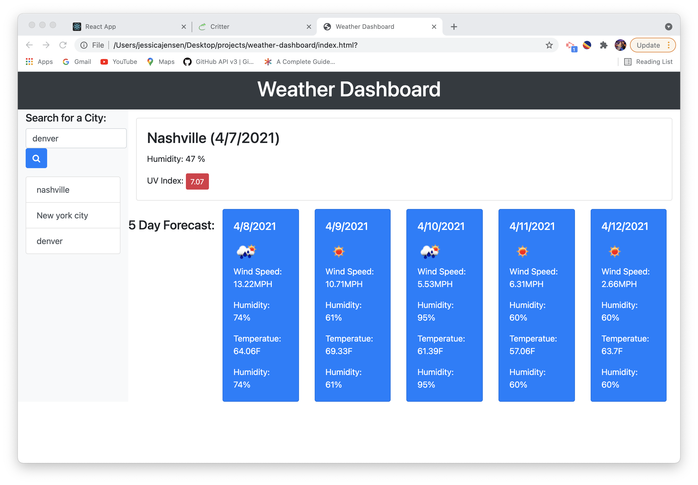

# Weather Dashboard

## Purpose
A simple weather application that will display current weather information as well as a five-day forecast for the user-selected city.

## Features 
The OpenWeather API to retrieve weather data for cities. When you view the cities, you will see the weather conditions for temperature, humidity, wind speed, & UV Index.  

## Built With:
* HTML
* CSS
* JavaScript
* Bootstrap

## Web Page

## Contributors:
Jessica Jensen
GitHub Link: https://github.com/jrjensen14/weather-dashboard.git 